# Clueso System Architecture & Collaboration Flowcharts

## 🏗️ System Overview Architecture


## 🤝 Collaboration Workflow


## 🎥 Video Recording & Processing Flow


## 🔄 Real-time Collaboration Data Flow


## 🔐 Authentication & Security Flow

```mermaid
sequenceDiagram
    participant Browser as 🌐 Browser
    participant Frontend as 🖥️ Frontend
    participant AuthStore as 📦 Auth Store
    participant Backend as ⚙️ Backend
    participant JWT as 🔑 JWT Service
    participant Database as 🗄️ Database

    Note over Browser,Database: User Registration Flow
    Browser->>Frontend: Fill registration form
    Frontend->>Backend: POST /api/auth/register
    Backend->>Database: Check if user exists
    alt User doesn't exist
        Backend->>Database: Create new user (hashed password)
        Backend->>JWT: Generate JWT token
        JWT-->>Backend: Return signed token
        Backend-->>Frontend: {success: true, user, token}
        Frontend->>AuthStore: Store user & token
        AuthStore->>Browser: Update localStorage
        Frontend-->>Browser: Redirect to dashboard
    else User exists
        Backend-->>Frontend: {success: false, message: "User exists"}
        Frontend-->>Browser: Show error message
    end

    Note over Browser,Database: User Login Flow
    Browser->>Frontend: Fill login form
    Frontend->>Backend: POST /api/auth/login
    Backend->>Database: Find user by email
    Backend->>Backend: Compare password hash
    alt Valid credentials
        Backend->>JWT: Generate JWT token
        JWT-->>Backend: Return signed token
        Backend-->>Frontend: {success: true, user, token}
        Frontend->>AuthStore: Store user & token
        AuthStore->>Browser: Update localStorage
        Frontend-->>Browser: Redirect to dashboard
    else Invalid credentials
        Backend-->>Frontend: {success: false, message: "Invalid credentials"}
        Frontend-->>Browser: Show error message
    end

    Note over Browser,Database: Protected API Calls
    Browser->>Frontend: Access protected feature
    Frontend->>AuthStore: Get stored token
    AuthStore-->>Frontend: Return JWT token
    Frontend->>Backend: API call with Authorization header
    Backend->>JWT: Verify token signature
    alt Valid token
        JWT-->>Backend: Token valid, return user data
        Backend->>Database: Execute requested operation
        Database-->>Backend: Return data
        Backend-->>Frontend: {success: true, data}
        Frontend-->>Browser: Display data
    else Invalid/Expired token
        JWT-->>Backend: Token invalid
        Backend-->>Frontend: {success: false, message: "Unauthorized"}
        Frontend->>AuthStore: Clear stored auth data
        Frontend-->>Browser: Redirect to login
    end

    Note over Browser,Database: Auto-logout on Token Expiry
    Frontend->>Frontend: Check token expiry (7 days)
    alt Token expired
        Frontend->>AuthStore: Clear auth data
        AuthStore->>Browser: Clear localStorage
        Frontend-->>Browser: Redirect to login
    end
```



## 🎛️ State Management Architecture

```mermaid
graph TB
    subgraph "Zustand Stores"
        AuthStore[Auth Store<br/>- user<br/>- token<br/>- isAuthenticated<br/>- login/logout]
        ProjectStore[Projects Store<br/>- projects[]<br/>- currentProject<br/>- CRUD operations]
        CollabStore[Collaboration Store<br/>- comments[]<br/>- languages[]<br/>- aiSuggestions[]<br/>- aiReview]
    end

    subgraph "React Components"
        AuthModal[Auth Modal]
        Dashboard[Dashboard]
        VideoPlayer[Video Player]
        CollabPanel[Collaboration Panel]
        Timeline[Timeline]
        Transcript[Transcript Panel]
    end

    subgraph "Custom Hooks"
        WebSocketHook[useWebSocketConnection<br/>- connectionState<br/>- videoData<br/>- audioData<br/>- instructions]
    end

    subgraph "API Services"
        AuthAPI[authAPI]
        ProjectsAPI[projectsAPI]
        CollabAPI[collaborationAPI]
        RecordingAPI[recordingAPI]
    end

    subgraph "Backend APIs"
        AuthEndpoints[/api/auth/*]
        ProjectEndpoints[/api/projects/*]
        CollabEndpoints[/api/collaboration/*]
        RecordingEndpoints[/api/recording/*]
    end

    subgraph "WebSocket Events"
        WSEvents[Socket Events<br/>- video<br/>- audio<br/>- instructions<br/>- new_comment<br/>- ai_suggestions]
    end

    subgraph "Persistent Storage"
        LocalStorage[localStorage<br/>- Auth data<br/>- Session cache]
        SessionStorage[sessionStorage<br/>- Temporary data]
    end

    %% Component to Store connections
    AuthModal --> AuthStore
    Dashboard --> ProjectStore
    CollabPanel --> CollabStore
    VideoPlayer --> WebSocketHook
    Timeline --> WebSocketHook
    Transcript --> WebSocketHook

    %% Store to API connections
    AuthStore --> AuthAPI
    ProjectStore --> ProjectsAPI
    CollabStore --> CollabAPI

    %% API to Backend connections
    AuthAPI --> AuthEndpoints
    ProjectsAPI --> ProjectEndpoints
    CollabAPI --> CollabEndpoints
    WebSocketHook --> RecordingEndpoints

    %% WebSocket connections
    WebSocketHook -.-> WSEvents
    CollabStore -.-> WSEvents

    %% Persistent storage
    AuthStore --> LocalStorage
    WebSocketHook --> SessionStorage

    %% Styling
    classDef store fill:#e3f2fd
    classDef component fill:#f3e5f5
    classDef hook fill:#e8f5e8
    classDef api fill:#fff3e0
    classDef backend fill:#fce4ec
    classDef websocket fill:#f1f8e9
    classDef storage fill:#fff8e1

    class AuthStore,ProjectStore,CollabStore store
    class AuthModal,Dashboard,VideoPlayer,CollabPanel,Timeline,Transcript component
    class WebSocketHook hook
    class AuthAPI,ProjectsAPI,CollabAPI,RecordingAPI api
    class AuthEndpoints,ProjectEndpoints,CollabEndpoints,RecordingEndpoints backend
    class WSEvents websocket
    class LocalStorage,SessionStorage storage
```

## 🚀 Deployment Architecture


## 📊 Performance & Scalability Considerations

### Horizontal Scaling Strategy


This comprehensive architecture documentation shows how all components work together to create a robust, scalable, and maintainable system for the Clueso platform.